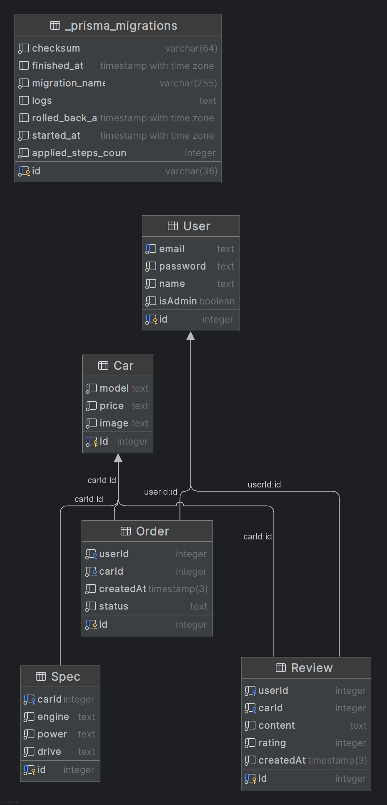

# Falcon Motors — Лабораторная работа №1

## 📌 Описание проекта

Это NestJS-приложение с интеграцией клиентской части из предыдущего семестра. Проект реализует шаблонизацию с использованием Handlebars (hbs) и задеплоен на Render.

Реализована поддержка состояний авторизации (вошёл / не вошёл), вывод карточек моделей яхт, статические страницы (Конструктор, Отзывы, О нас, Контакты, Поддержка) через public/html, а также подключены повторяющиеся компоненты как partials (header, footer, menu, session и т.д.).

---

## 👤 Автор

ФИО: Сокол Тимофей Александрович  
Группа: M3310

---

## 🚀 Ссылка на развернутое приложение

(https://lab-web-m2e2.onrender.com)

---

## ⚙️ Технологии

- NestJS
- Node.js
- Handlebars (hbs)
- Express
- HTML + CSS (frontend из прошлого семестра)
- Render (cloud deployment)
